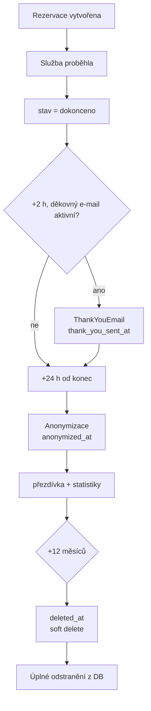

# Životní cyklus rezervace a ochrana osobních údajů

Tento dokument popisuje, jak systém zpracovává data rezervace od vytvoření po úplné odstranění.  
Veškeré kroky řídí **jeden cron** — `python manage.py rezervace_zivotni_cyklus` (hodinově).

Starší příkazy `odesli_pripominky` a `gdpr_udrzba` jsou jen aliasy stejné logiky.

---

## Diagram životního cyklu

```
Rezervace vytvořena
        │
        ▼
Proběhla služba
        │
        ▼
Rezervace = Dokončeno          (personál označí v kalendáři)
        │
        ├──────────────────────┐
        ▼                      │  (děkovný e-mail vypnutý)
   +2 hodiny                    │
        │                      │
        ▼                      │
 Děkovný e-mail                │
 thank_you_sent_at = now       │
        │                      │
        └──────────┬───────────┘
                   ▼
            +24 hodin od konce služby (konec)
                   ▼
            Anonymizace
            anonymized_at = now
                   ▼
        Zůstává pouze:
          • přezdívka / jméno
          • historie rezervace (bez e-mailů)
          • agregované statistiky salonu
                   ▼
            +12 měsíců od konce služby
                   ▼
      deleted_at = now  (zmizí z kalendáře salonu)
                   ▼
      Fyzické smazání z DB + úklid audit logu
```

### Mermaid (pro nástroje podporující Mermaid)



---

## Časová osa (stav `dokonceno`)

| Okamžik | Co se stane | Pole na modelu |
|---------|-------------|----------------|
| Konec služby | Personál vidí e-mail zákazníka | — |
| +2 h | Děkovný e-mail (pokud zapnutý) | `thank_you_sent_at` |
| +24 h | E-mail u salonu zmizí | `anonymized_at` |
| +12 měsíců | Záznam zmizí z kalendáře | `deleted_at` |
| +12 měsíců | Fyzické smazání + úklid historie | řádek smazán |

U stavů `no_show`, `zakaznik_storno`, `salon_storno` se děkovný e-mail neposílá — anonymizace proběhne po 24 h od `konec` bez podmínky na `thank_you_sent_at`.

---

## Podmínky v kódu (jednoduché)

Implementace: `backend/rezervace/services/zivotni_cyklus.py`

### Děkovný e-mail

```text
stav == dokonceno
AND thank_you_sent_at IS NULL
AND děkovný e-mail je aktivní v nastavení
AND konec + 2 h je v odesílacím okně
→ odešli e-mail, nastav thank_you_sent_at
```

### Anonymizace

```text
anonymized_at IS NULL
AND deleted_at IS NULL
AND stav ∈ {dokonceno, no_show, zakaznik_storno, salon_storno}
AND now >= konec + 24 h
AND (
      stav != dokonceno
      OR NOT děkovný_e-mail_aktivní
      OR thank_you_sent_at IS NOT NULL
    )
→ anonymizuj_obsah_rezervace(), nastav anonymized_at
```

### Smazání

```text
anonymized_at IS NOT NULL
AND deleted_at IS NULL
AND now >= konec + 12 měsíců
→ deleted_at = now (soft delete, zmizí z kalendáře)

deleted_at starší 12 měsíců
→ fyzické smazání rezervace, historie, audit logu
```

---

## Cron — nasazení

```bash
# Doporučený jediný cron (každou hodinu)
0 * * * * cd /app/backend && python manage.py rezervace_zivotni_cyklus
```

Zpětná kompatibilita:

```bash
python manage.py odesli_pripominky   # alias
python manage.py gdpr_udrzba         # alias
```

---

## Model `Rezervace` — životní cyklus

| Pole | Význam |
|------|--------|
| `dokonceno_at` | Kdy personál označil službu jako proběhlou |
| `thank_you_sent_at` | Kdy byl odeslán děkovný e-mail (`NULL` = ještě ne) |
| `anonymized_at` | Kdy byly smazány osobní údaje u salonu (`NULL` = e-mail ještě viditelný) |
| `deleted_at` | Kdy byl záznam vyřazen z provozu (`NULL` = v kalendáři) |

Výchozí manager `Rezervace.objects` vrací jen záznamy s `deleted_at IS NULL`.  
Pro údržbu cron používá `Rezervace.all_objects`.

---

## Co salon vidí vs. administrátor platformy

| Fáze | Salon (kalendář) | Platforma |
|------|------------------|-----------|
| Před službou | e-mail, přezdívka | totéž |
| Po službě, před +24 h | e-mail (pro platbu QR, NO-show) | totéž |
| Po anonymizaci | jen přezdívka | anonymizovaný záznam pro statistiky |
| Po +12 měsíců | nic | záznam smazán |

Marketingové e-maily se neodesílají. Údaje se mezi salony nesdílejí.

---

## Související soubory

| Soubor | Účel |
|--------|------|
| `rezervace/services/zivotni_cyklus.py` | Orchestrace celého cyklu |
| `rezervace/services/gdpr.py` | Anonymizace obsahu, hash e-mailů |
| `rezervace/management/commands/rezervace_zivotni_cyklus.py` | Cron příkaz |
| `salon*/ochrana-osobnich-udaju.html` | Text pro zákazníky |
